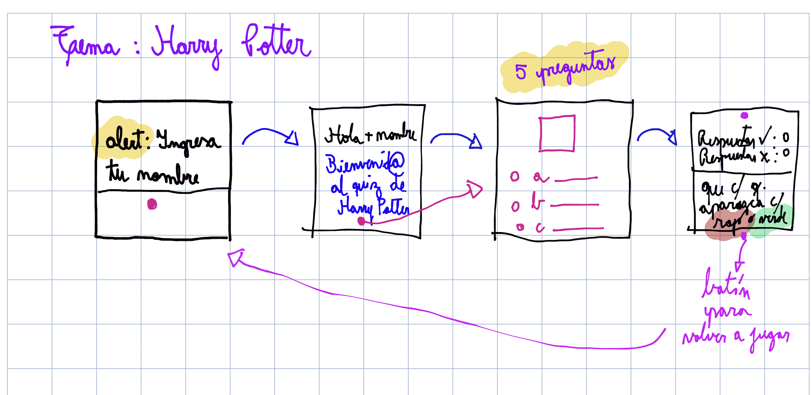

# Trivia de Harry Potter
Esta es una trivia creada con el fin de entretener y ver qué tanto conoces de esta saga que es tan famosa en todo el mundo.
## Triada 3.1
Mi nombre es Consuelo
## ¿Cómo empezó esto?
Nuestro primer diseño al planificar nuestro proyecto

**_Decidimos que tendría 5 preguntas de 3 alternativas_**

## Disponible en: https://enchantress21001990.github.io/TriviaHarryPotter/#containerdeJuego5

## ¿Cómo jugar?
Al iniciar la página, se te pedirá ingresar tu nombre. No lo dejes vacío ni uses sólo números!

Nuestro juego es muy amigable, y te saludará! Estás invitad@ a ingresar al juego, y al hacer click se te desplegará la primera pregunta. Las demás irán apareciendo a medida que las completes!

Cuando termines de responder las preguntas, lo sabrás, porque aparecerá el botón de Terminar Juego.

Este botón es muy útil! Nos ayudará a saber en qué respuestas acertamos y en cuáles no, ya que las opciones escogidas serán rojas o verdes de acuerdo a si conseguimos la respuesta correcta.

Además, este botón también nos dirá cuántas respuestas correctas e incorrectas conseguimos!!!

Cuando hayas terminado, quizá quieras invitar a alguien más a jugar, o quizá quieras conseguir puntaje perfecto, por lo que reiniciar la partida siempre es una opción. Puedes hacerlo con este botón.

Y listo! Como nuevo!!! Todo listo para volver a empezar!

## ¿Qué podemos decir de nuestro trabajo?
-Pensamos en una interfaz que fuera llamativa, dinámica, interesante y que fuera atractiva para personas que disfrutan de Harry Potter. 
-Nos habría encantado tener más tiempo para hacerla aún más grande. Tiene mucho potencial: Puede ser desarrollada a un nivel mucho más alto en complejidad, incluso con trivias hechas a nivel de conocimiento de cada usuario (por ejemplo fácil, medio, difícil, con desarrollo o incluso completar oraciones), con sonidos para animar cada acción de botón y también podrían implementarse animaciones. Queda como meta!!
-Al inicio pensamos en trabajar con inputs tipo radio, pero el deseo de poder aplicarles personalización más estética y también el manejo de datos desde JavaScript nos incentivaron a tomar los select con sus options.
-El proceso de diseño y desarrollo lo realizamos en forma paralela, con el fin de ir dando funcionalidad en un lapso de tiempo relativamente corto a todos los aspectos de nuestro HTML base.

